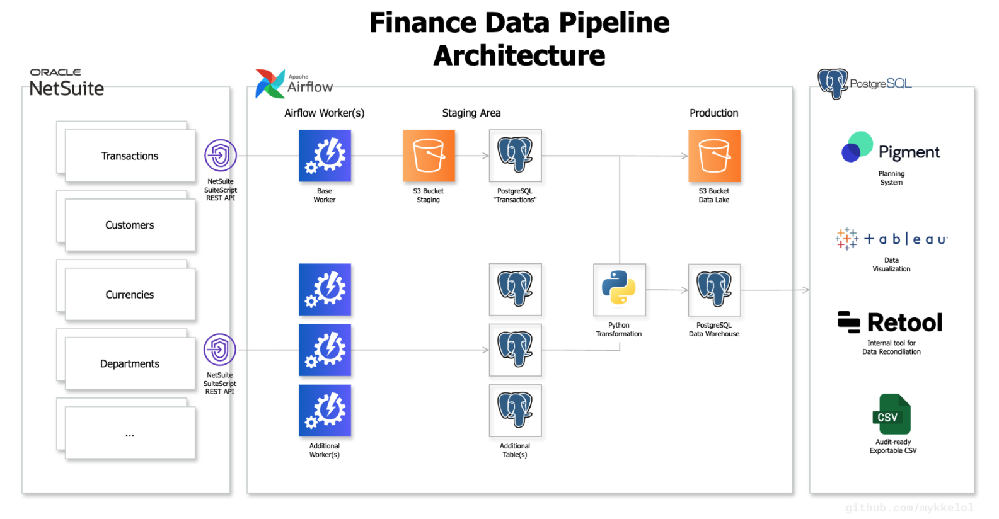
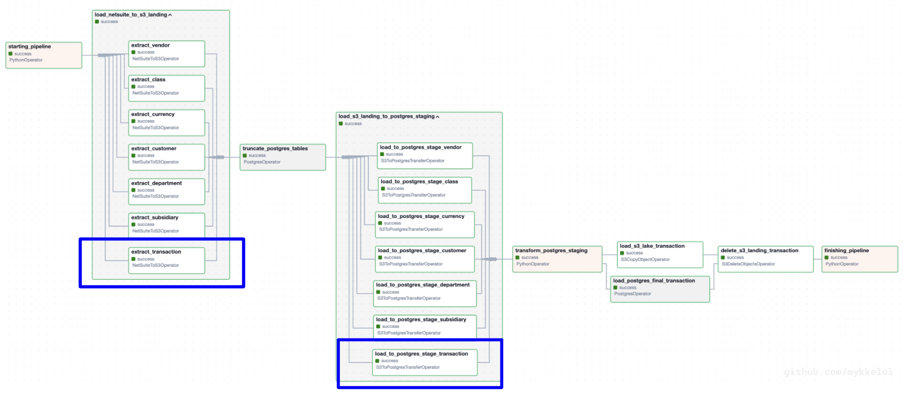

# Finance Data Pipeline

[](https://travis-ci.org/mykkelol/netsuite-data-pipeline) [](https://coveralls.io/github/mykkelol/netsuite-data-pipeline?branch=main) [](https://www.python.org/downloads/release/python-390/) [](https://docs.oracle.com/en/cloud/saas/netsuite/ns-online-help/chapter_156042690639.html#SuiteScript-2.1) [](./LICENSE)

In 2023, India Ministry of Corporate Affairs (MCA) mandated all enterprises operating in India—including US-based companies with branches in India—to maintain daily backups of all financial data and related documents (👉 see [MCA Notification 21st August 2022](https://resource.cdn.icai.org/71244clcgc160822.pdf)). For many Finance teams, complying to this mandate is added burden of manual work and costly implementations.

**Finance Data Pipeline** is a purpose-built automated data pipeline to help Finance teams comply with evolving accounting standards and regulations without increasing manual work. The data pipeline leverages parallel programming, REST APIs, and incremental load ELT architecture to support the following stack:

- **ERP**: [NetSuite](https://www.netsuite.com/), [SuiteScript](https://docs.oracle.com/en/cloud/saas/netsuite/ns-online-help/section_4387799403.html#SuiteScript-2.x-RESTlet-Script-Type)
- **Orchestrator**: [Airflow](https://airflow.apache.org/)
- **Data storage**: [Postgres](https://www.postgresql.org/), [AWS S3](https://aws.amazon.com/s3/)
- **Analytics**: [Tableau](https://help.tableau.com/current/pro/desktop/en-us/examples_postgresql.htm), [Mode](https://mode.com/integrations/postgresql), [Adaptive Planning](https://hightouch.com/integrations/postgresql-to-workday-adaptive-planning)
- **Internal Tool**: [Retool](https://docs.retool.com/data-sources/quickstarts/database/postgresql)

# Architecture



# How it works

**Finance Data Pipeline** facilitates Finance teams' compliance requirements without increasing manual work. It leverages Airflow, parallel programming, and an incremental load ELT architecture to automatically:

1. **Extract data from NetSuite ERP** by executing a pool of DAG tasks hourly to call a custom NetSuite SuiteScript API to extract transactions and related metadata such as vendors, customers, employees, departments, files, etc. asynchronously and dynamically.
2. **Load data** into SQL warehouse and India-hosted S3 lake
3. **Transform data** to structured, audit-ready, and reportable data, empowering Finance and Accounting teams to consume the Financial data directly in analytics tools like Mode, Tableau, Adaptive, and Pigment, as well as custom reconciliation tools such as Retool and Superblocks.

Data engineers interested in this project must have knowledge of NetSuite, SuiteScript 2.1+, Accounting, and REST APIs to effectively operate the custom Airflow's NetSuite operators.

# Running Locally

### Step 1: Create NetSuite API

Create a SuiteScript 2.1+ RESTlet script to deploy a custom NetSuite REST API, retrieve its `script_id`, and store in `.env` file similar to [.env.example](./.env.example) or in Airflow UI through `Admin`/`Variables` and `Admin`/`Connections`

```JavaScript
define(['N/search'], function (search) {
    return onRequest: (c) => {
        const { type, id, filters, columns } = c;
        return search.create({
            type
            id,
            filters,
            columns
        })
        .run()
        .getRange(start, end)
        .map(rows => rows.getValue())
        .reduce((rows, row) => {
            return rows;
        }, results: [])
    }
})
```

### Step 2: Build Airflow project

```bash
git clone https://github.com/mykkelol/netsuite-data-pipeline
cd netsuite-data-pipeline
python3 -m pip install docker
python3 -m pip install docker-compose
docker build -t extending-airflow:latest .
docker-compose up -d
```

### Step 3: Create tables in SQL severs

```sql
CREATE TABLE IF NOT EXISTS my_table_name (
    id VARCHAR(255),
    duedate DATE,
    trandate DATE,
    amount DECIMAL,
    tranid VARCHAR(255),
    entity VARCHAR(255),
    status VARCHAR(255),
    currency VARCHAR(255),
    department VARCHAR(255),
    record_type VARCHAR(255),
    requester_name VARCHAR(255),
    requester_email VARCHAR(255),
    nextapprover_name VARCHAR(255),
    nextapprover_email VARCHAR(255),
    transaction_number VARCHAR(255),
    PRIMARY KEY(id)
)
```

### Step 4: Configure DAG

In [dags_config.py](./dags/dags_config.py), `RECORD_TYPE`/`search_id` is required to run the DAG. In the DAG below, the highlighted tasks represents the single `transaction` element required in `RECORD_TYPE` and `search_id`.



Optionally, set-up `subsearches` property by adding a tuple of (`record_type`, `search_id`, `filters`) in [dags_config.py](./dags/dags_config.py) to configure the DAG to automatically create multiple task instances dynamically and group them to run in parallel with Airflow pool to optimize and enrich the data pipeline.

```python
{
    'type': 'transaction',
    'search_id': 'search_id',
    'subsearches': [
        ('transaction', 'customsearch_gl_posting_transactions_india', []),
        ('customer', 'customsearch_customer', []),
        ('currency', 'customsearch_currency', []),
        ('some_record_type', 'customsearch_id', []),
    ]
}
```

# License

- You are free to fork and use this code directly according to the Apache License (👉 see [LICENSE](./LICENSE)).
- Please do not copy it directly.
- Crediting the author is appreciated.

# Contact

- Github [@mykkelol](https://github.com/mykkelol)
- LinkedIn [/msihavong](https://linkedin.com/in/msihavong)
